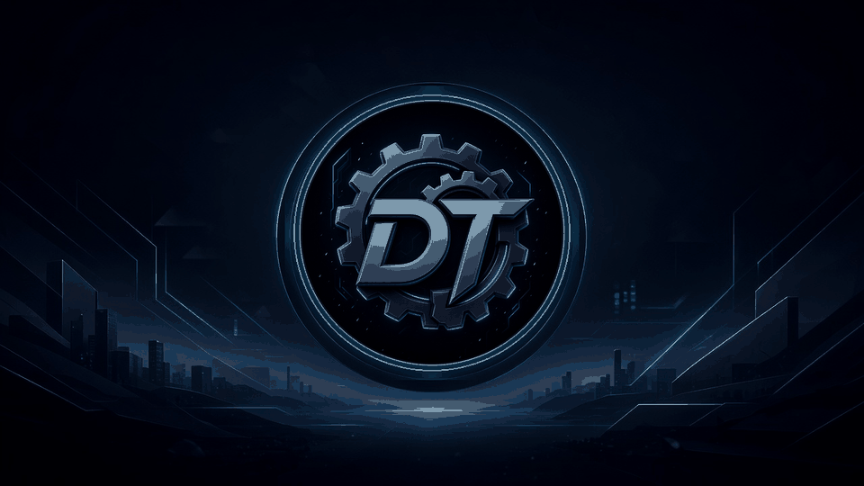

  
  <h1>Darren Tarrant</h1>
  <h3>
    <b>AI | Full-Stack Engineer | Reverse Engineer | Automation Engineer | Go • Python • TypeScript | AIO/ACO | Ticketing | Retail | APIs | Web Scraping | Monitoring</b>
  </h3>
  

 

### Perspective

I build under contested conditions: protected APIs, brittle retail paths, queues that cannot stall, and browsers that resist automation. The craft is technical. The aim is practical — remove friction without erasing the human part of the work.

Titles alone will not hold as routine labour is automated. That pressure is why I focus on systems that free attention rather than flatten it.

### Focus

**AI** — agents, retrieval pipelines, and workflow automation that ship in production, not demos.

**Full-Stack Engineer** — services, interfaces, and data paths that stay coherent from request to delivery.

**Reverse Engineer** — protocol and protection analysis when the surface API is incomplete or actively hostile.

**Automation Engineer** — durable bots, monitors, and orchestration for high-concurrency workloads.

Highlighted domains:

- **Go • Python • TypeScript** for services, tooling, and product surfaces
- **AIO / ACO** for checkout and acquisition systems under load
- **Ticketing** and **Retail** flows: inventory, sessions, accounts, and recovery paths
- **APIs**, **Web Scraping**, and **Monitoring** for signal, scale, and early failure detection

I work with a small group of engineers and researchers — short prototypes when speed matters, longer engagements when reliability does.

### Tools

<table>
  <tr>
    <td align="center" width="96">
       C#
    </td>
    <td align="center" width="96">
       Python
    </td>
    <td align="center" width="96">
       Javascript
    </td>
    <td align="center" width="96">
       C++
    </td>
    <td align="center" width="96">
       Django
    </td>
    <td align="center" width="96">
       Github
    </td>
    <td align="center" width="96">
       Rest API
    </td>
    <td align="center" width="96">
       React
    </td>
    <td align="center" width="96">
       Nginx
    </td>
  </tr>
  <tr>
    <td align="center" width="96">
       Git
    </td>
    <td align="center" width="96">
       GitLab
    </td>
    <td align="center" width="96">
       HTML
    </td>
    <td align="center" width="96">
       CSS
    </td>
    <td align="center" width="96">
       Bootstrap
    </td>
    <td align="center" width="96">
       Tailwind
    </td>
    <td align="center" width="96">
       JQuery
    </td>
    <td align="center" width="96">
       PostgreSQL
    </td>
    <td align="center" width="96">
       ASP.NET
    </td>
  </tr>
  <tr>
    <td align="center" width="96">
       Redis
    </td>
    <td align="center" width="96">
       Postman
    </td>
    <td align="center" width="96">
       Linux
    </td>
    <td align="center" width="96">
       Dart
    </td>
    <td align="center" width="96">
       RabbitMQ
    </td>
    <td align="center" width="96">
       Sentry
    </td>
    <td align="center" width="96">
       Celery
    </td>
    <td align="center" width="96">
       Docusaurus
    </td>
    <td align="center" width="96">
       Pytest
    </td>
  </tr>
</table>

### Activity

  
  

### Correspondence

  
  &nbsp;
  
  &nbsp;
  

